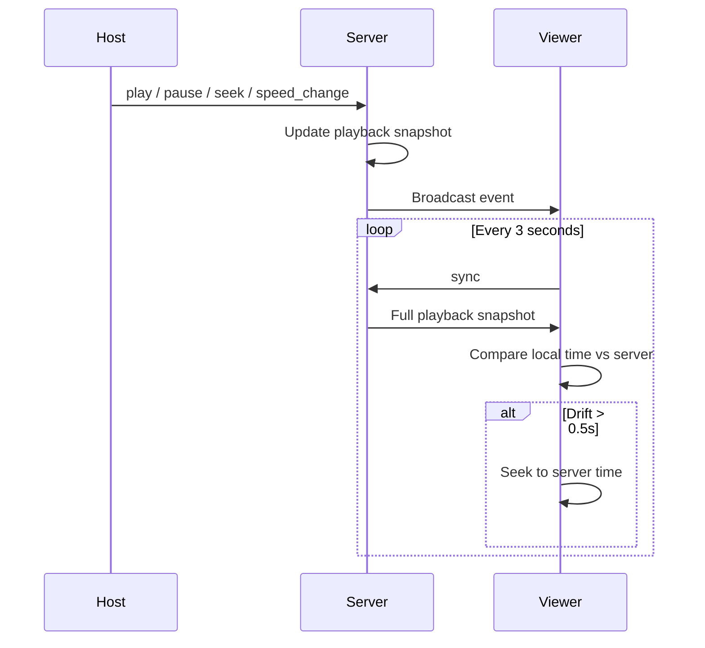

# Grapevibe — Complete Documentation

**Grapevibe** is a free online watch party app for watching YouTube (and direct video links) together with friends in real time. No account sign-up, no install — create a room, share the link or room ID, and everyone stays in sync.

---

## Table of contents

1. [What is Grapevibe?](#what-is-grapevibe)
2. [Key features](#key-features)
3. [User guide](#user-guide)
4. [Room layout](#room-layout)
5. [Playlist modes & settings](#playlist-modes--settings)
6. [Permissions & host controls](#permissions--host-controls)
7. [Playback synchronization](#playback-synchronization)
8. [Search & discovery](#search--discovery)
9. [Connection & reconnection](#connection--reconnection)
10. [Keyboard shortcuts](#keyboard-shortcuts)
11. [Architecture overview](#architecture-overview)
12. [Server state model](#server-state-model)
13. [Socket.IO events](#socketio-events)
14. [HTTP API](#http-api)
15. [Tech stack](#tech-stack)
16. [Project structure](#project-structure)
17. [Development & deployment](#development--deployment)

---

## What is Grapevibe?

Grapevibe lets a group of people watch the same video at the same time from different devices. One person is the **host** and controls play, pause, seek, skip, and playback speed for everyone. Viewers follow the host automatically with drift correction so playback stays aligned within about half a second.

Rooms are identified by short, memorable IDs (e.g. `starlight7x`). Users pick a display name stored locally in the browser — no login required.

---

## Key features

| Feature | Description |
|--------|-------------|
| **Instant rooms** | Create a room in one click; share link or copy room ID |
| **YouTube sync** | Embedded YouTube player with host-controlled playback |
| **Direct video URLs** | Paste MP4 or other direct video links |
| **Shared playlist** | Queue up to 50 videos; auto-advance when a video ends |
| **Queue vs List modes** | Queue removes played items; List keeps them |
| **Shuffle** | Random next track (host setting) |
| **YouTube search** | Search on Enter / search button (no search-while-typing) |
| **Similar songs** | Auto-suggested related videos based on what's playing |
| **Host transfer** | Manual transfer, auto-transfer when host leaves, or viewer claim |
| **Reconnection** | Auto-reconnect with banner, manual reconnect, copy room ID |
| **Keyboard shortcuts** | Space, arrows for play/pause, volume, seek |
| **Mobile-friendly** | Responsive layout for phones and desktops |

---

## User guide

### Getting started

1. Open the home page.
2. Enter a **display name** (saved in your browser).
3. Click **Start Watching Together** to create a room, or enter a room ID and click **Join**.

### Joining via link

Room URLs look like:

```
https://your-domain.com/room/starlight7x
```

You can also copy just the **room ID** (`starlight7x`) from the header and share it — others paste it on the home page to join.

### In the room

| Action | Who can do it |
|--------|----------------|
| Search & add videos to playlist | Everyone |
| Play a video from the playlist | Everyone |
| Play / pause / seek / skip / speed | Host only |
| Reorder, remove, clear playlist, play-next | Host, or everyone if enabled in settings |
| Change room settings | Host only |
| Transfer host to someone else | Host only |
| Become host | Viewers, only if host enabled “Anyone can become host” |

### Inviting friends

- **Invite** — copies the full room URL.
- **Copy ID** — copies only the room ID.

### Participants

Click the **watching** control in the header to see everyone in the room, who is host, and (if you are host) **Make host** on other users.

---

## Room layout

```
┌─────────────────────────────────────────────────────────────────┐
│  Logo │ /roomId [Copy ID] │ [Watching ▼] │ Invite │ Settings │ ● │
├─────────────────────────────────────────────────────────────────┤
│  [Connection banner — only when disconnected / reconnecting]    │
├──────────────────────────────┬──────────────────────────────────┤
│  LEFT COLUMN                 │  RIGHT COLUMN (Discover)          │
│  • Video player              │  • Search bar                     │
│  • Title & progress bar      │  • Similar songs (when playing)   │
│  • Play controls (host)      │  • Search results (on submit)     │
│  • Volume (local per user)   │  • Video cards → queue / play now │
│  • Playlist (queue/list)     │                                   │
└──────────────────────────────┴──────────────────────────────────┘
```

- **Left**: playback and playlist.
- **Right**: YouTube search, URL paste, and similar-song suggestions.

---

## Playlist modes & settings

Open **Settings** (gear icon) in the room header. Hosts can change all options; viewers see a read-only summary.

### Playlist mode

| Mode | Behavior |
|------|----------|
| **List** (default) | Videos stay in the playlist when played. Next track advances by index. |
| **Queue** | Videos are **removed** from the list when playback starts. |

### Shuffle

When enabled, the next video after the current one ends is chosen randomly (List mode respects current position for exclusion).

### After clicking a queue video

When someone jumps to a specific playlist item mid-playback:

| Setting | Behavior |
|---------|----------|
| **Continue** (default) | After that video ends, play the **next item after it** in the list. |
| **Resume order** | After that video ends, play the **front of the queue** again. |

### Permissions (host toggles)

| Setting | Default | Effect |
|---------|---------|--------|
| **Everyone can edit playlist** | `true` | Viewers can reorder, remove, play-next, and clear the queue. |
| **Everyone can control playback** | `false` | Viewers can play, pause, seek, skip, and change speed — changes sync for everyone in the room. |
| **Anyone can become host** | `false` | Viewers get a “Become host” button in Settings and the participants menu. |

> **Note:** Everyone can always add songs to the playlist.

---

## Permissions & host controls

### Role capabilities

```
                    Host    Viewer (default)    Viewer (+ edit playlist)    Viewer (+ control playback)
────────────────────────────────────────────────────────────────────────────────────────────────────
Add to playlist      ✓            ✓                      ✓                            ✓
Play from queue      ✓            ✓                      ✓                            ✓
Control playback     ✓            ✗                      ✗                            ✓
Edit playlist        ✓            ✗*                     ✓*                           ✗*
Change settings      ✓            ✗                      ✗                            ✗
Transfer host        ✓            ✗                      ✗                            ✗
Claim host           ✗**          ✗**                    ✗**                          ✗**

* Only if "Everyone can edit playlist" is on
** Only if "Anyone can become host" is on
```

### Host lifecycle

1. **Room creator** is the initial host (`bootstrapAsHost` on first join).
2. **Host leaves** → oldest remaining participant becomes host automatically.
3. **Host transfers** → current host picks someone in the participants list.
4. **Viewer claims** → if setting enabled, any viewer can take host via Settings.

When the last person leaves, the room is **deleted** from server memory.

---

## Playback synchronization

Grapevibe uses a **host-authoritative** model with **viewer drift correction**.

### How it works



### Server playback snapshot

The server stores:

- Current video
- `currentTime` (seconds)
- `playing` (boolean)
- `speed` (0.25× – 2×)
- `lastUpdated` timestamp

When computing position for sync, elapsed real time is added while `playing` is true, multiplied by `speed`.

### Client players

| Source | Player |
|--------|--------|
| YouTube | YouTube IFrame API (`useYouTubePlayer`) |
| Direct URL | HTML `<video>` element (`useVideoPlayer`) |

**Host** drives the player and emits socket events. **Viewers** mirror server state and request periodic sync snapshots.

Constants (from `src/lib/types.ts`):

- `SYNC_INTERVAL_MS = 3000` — viewers poll every 3 seconds
- `DRIFT_THRESHOLD_SEC = 0.5` — seek if local time differs by more than 500 ms

### Auto-advance

When the host’s player fires `ENDED` (or host clicks skip):

1. Server runs `loadNextVideo()` using playlist mode, shuffle, and jump rules.
2. If queue empty → `queue_empty` event; playback clears.
3. Otherwise → `video_changed` with autoplay.

---

## Search & discovery

### YouTube search

- Search runs **only** when the user presses **Enter** or clicks the **search button** — not while typing.
- Uses public **Piped** and **Invidious** instances (no YouTube Data API key).
- Minimum query length: 2 characters.

### Paste URL

The search bar detects:

- YouTube URLs → extract `videoId`, show Add to queue / Play now
- Direct HTTP video URLs → add as `direct` source

### Similar songs

When nothing is being searched and a YouTube video is playing:

1. Client calls `/api/related?videoId=…&title=…&channel=…`
2. Server fetches metadata from Piped, filters remix/same-song variants
3. Builds similarity queries from tags, artist, channel, era/genre
4. Falls back to title/channel search if needed
5. Always returns `{ items: [...] }` — no error banners in the UI

---

## Connection & reconnection

Socket.IO connects to `/socket.io` on the same server as Next.js (`server.ts` custom HTTP server).

### Connection states

| State | UI |
|-------|-----|
| `connecting` | Amber banner: “Joining room…” |
| `connected` | Green dot in header |
| `reconnecting` | Amber banner + auto-retry |
| `offline` | Red banner + Reconnect / Copy ID / Reload page |

### Reconnection behavior

- **Unlimited** automatic reconnection attempts with backoff (1s – 8s).
- On reconnect → re-emit `room_join` → receive fresh `room_joined` payload.
- Toast: “Reconnected — back in sync”.
- Manual **Reconnect** button calls `socket.connect()` and re-joins the room.

---

## Keyboard shortcuts

Active when a video is loaded and focus is not in an input field.

| Key | Host | Viewer |
|-----|------|--------|
| `Space` | Play / pause | — |
| `↑` / `↓` | Volume ±5% | Volume ±5% (local) |
| `←` / `→` | Seek ±5s | — |
| `Shift + ←/→` | Seek ±10s | — |

Volume is **per-user** (stored in browser localStorage), not synced across the room.

---

## Architecture overview

```
┌──────────────┐     HTTP (pages, API)      ┌─────────────────────────┐
│   Browser    │ ─────────────────────────► │  server.ts              │
│   (React)    │                              │  ├── Next.js app        │
│              │     WebSocket (Socket.IO)    │  └── Socket.IO server   │
└──────────────┘ ◄─────────────────────────► └─────────────────────────┘
                                                        │
                                                        ▼
                                              ┌─────────────────────────┐
                                              │  globalThis.__synctubeRooms │
                                              │  (in-memory room store)     │
                                              └─────────────────────────┘
```

- **Single Node process** runs Next.js and Socket.IO on one HTTP server.
- **Room state** lives in memory (`src/server/room-store.ts`) shared via `globalThis` so API routes and sockets use the same data.
- **Client state** uses Zustand (`roomStore`, `userStore`).

### Important: run the custom server

```bash
npm run dev    # tsx watch server.ts  ← use this
npm run start  # production
```

Do **not** use `next dev` alone — Socket.IO will not be available.

---

## Server state model

Each room (`RoomRuntime`) contains:

| Field | Type | Purpose |
|-------|------|---------|
| `meta` | `RoomMeta` | `id`, `hostId`, `createdAt` |
| `settings` | `RoomSettings` | Playlist & permission toggles |
| `queue` | `VideoItem[]` | Up to 50 items |
| `playback` | `PlaybackState` | Current video, time, playing, speed, jump rules |
| `members` | `Map<socketId, RoomMember>` | Connected participants |

### Video item

```ts
{
  id: string;           // unique queue item id
  source: "youtube" | "direct";
  videoId?: string;     // YouTube 11-char id
  url?: string;         // direct video URL
  title: string;
  thumbnail?: string;
  channel?: string;
  addedBy: string;      // userId
}
```

### Room IDs

Generated as `{word}{digit}{2-char suffix}` from a word list (e.g. `cosmic3ab`).

---

## Socket.IO events

### Client → Server

| Event | Permission | Payload | Effect |
|-------|------------|---------|--------|
| `room_join` | — | `{ roomId, bootstrapAsHost? }` | Join room; create if bootstrap |
| `update_username` | member | `{ username }` | Update display name |
| `settings_update` | host | `Partial<RoomSettings>` | Update room settings |
| `claim_host` | viewer* | — | Take host if allowed |
| `transfer_host` | host | `{ targetUserId }` | Assign host to another user |
| `video_added` | all | video fields | Add to queue; auto-play if idle |
| `video_load` | host | video fields | Play immediately (not from queue) |
| `video_removed` | edit* | `{ itemId }` | Remove queue item |
| `queue_clear` | edit* | — | Clear queue |
| `queue_reorder` | edit* | `{ itemId, direction }` | Move up/down |
| `queue_play_next` | edit* | `{ itemId }` | Move item to front |
| `video_changed` | all | `{ itemId }` | Play specific queue item |
| `play` | host | `{ currentTime }` | Play from time |
| `pause` | host | `{ currentTime }` | Pause at time |
| `seek` | host | `{ currentTime }` | Seek |
| `speed_change` | host | `{ speed }` | Set playback rate |
| `sync` | viewer | — | Request playback snapshot |
| `skip` | host | — | Load next video |
| `video_ended` | host | — | Load next video (from player ENDED) |

\* See permissions section.

### Server → Client

| Event | Payload |
|-------|---------|
| `room_joined` | Full room state + permissions |
| `member_joined` | `{ user, members }` |
| `member_left` | `{ userId, username, members }` |
| `members_updated` | `{ members }` |
| `host_changed` | `{ hostId, hostUsername, members }` |
| `settings_changed` | `{ settings }` |
| `permissions_changed` | `{ settings }` |
| `queue_updated` | `{ queue }` |
| `video_changed` | `{ video, queue, autoplay? }` |
| `queue_empty` | `{}` |
| `play` / `pause` / `seek` / `speed_change` | time or speed |
| `sync` | `PlaybackSnapshot` |
| `error` | `{ message }` |

---

## HTTP API

| Method | Route | Description |
|--------|-------|-------------|
| `POST` | `/api/rooms` | Create room `{ userId }` → `{ id, hostId, createdAt }` |
| `GET` | `/api/rooms?id=` | Check if room exists |
| `GET` | `/api/rooms/[roomId]` | Room exists check for join page |
| `GET` | `/api/search?q=` | YouTube search (min 2 chars) |
| `GET` | `/api/related?videoId=&title=&channel=` | Similar videos |

---

## Tech stack

| Layer | Technology |
|-------|------------|
| Framework | Next.js 16 (App Router) |
| UI | React 19, Tailwind CSS 4 |
| Real-time | Socket.IO 4 |
| Client state | Zustand (persisted user store) |
| Icons | Iconify |
| IDs | nanoid |
| YouTube data | Piped / Invidious (no API key) |
| Server runtime | Node.js + `tsx` |

---

## Project structure

```
synctube-next/
├── server.ts                 # Custom HTTP server (Next + Socket.IO)
├── src/
│   ├── app/                  # Next.js pages & API routes
│   │   ├── page.tsx          # Landing / create / join
│   │   ├── room/[roomId]/    # Room page
│   │   └── api/              # REST endpoints
│   ├── components/
│   │   ├── RoomView.tsx      # Main room UI
│   │   ├── VideoPicker.tsx   # Search & discover panel
│   │   ├── QueueList.tsx     # Playlist UI
│   │   ├── ParticipantsMenu.tsx
│   │   ├── ConnectionBanner.tsx
│   │   └── RoomSettingsMenu.tsx
│   ├── hooks/
│   │   ├── useRoomConnection.ts   # Socket client
│   │   ├── useYouTubePlayer.ts    # YouTube sync
│   │   ├── useVideoPlayer.ts      # Direct video sync
│   │   └── usePlaybackKeyboard.ts
│   ├── server/
│   │   ├── socket.ts         # Socket event handlers
│   │   └── room-store.ts     # In-memory room logic
│   ├── stores/
│   │   ├── roomStore.ts      # Live room state (client)
│   │   └── userStore.ts      # User id, name, volume
│   └── lib/
│       ├── types.ts          # Shared TypeScript types
│       ├── playlist.ts       # Queue/list helpers
│       ├── youtube-search.ts # Piped/Invidious search
│       ├── related-videos.ts # Similar songs algorithm
│       └── brand.ts          # App name & SEO copy
└── docs/
    └── GRAPEVIBE.md          # This file
```

---

## Development & deployment

### Local development

```bash
npm install
npm run dev
# → http://localhost:3000
```

### Environment variables

| Variable | Purpose |
|----------|---------|
| `PORT` | Server port (default `3000`) |
| `HOSTNAME` | Bind hostname (default `localhost`) |
| `NEXT_PUBLIC_APP_URL` | Canonical URL for SEO metadata |

### Production build

```bash
npm run build
npm run start
```

### Production hosting

Grapevibe is **not compatible with Vercel** (or any pure serverless Next.js host). Real-time sync uses Socket.IO on a custom HTTP server (`server.ts`). Vercel runs only `next build` output — it never starts `server.ts`, so clients get **404 on `/socket.io`**.

Deploy as **one Node service** (Next.js + Socket.IO + in-memory room store must share the same process):

| Platform | Notes |
|----------|--------|
| **Render** | Use repo `render.yaml` — build `npm ci && npm run build`, start `npm run start` |
| **Railway** | Start command: `npm run start`, set `NEXT_PUBLIC_APP_URL` |
| **Fly.io / Docker** | Use repo `Dockerfile` |
| **VPS** | `npm run build && npm run start` behind nginx/Caddy |

Environment variables:

| Variable | Purpose |
|----------|---------|
| `PORT` | Server port (default `3000`; Render/Railway set this automatically) |
| `HOSTNAME` | Bind address — use `0.0.0.0` in containers |
| `NEXT_PUBLIC_APP_URL` | Canonical URL for SEO metadata |
| `NEXT_PUBLIC_SOCKET_URL` | Optional; only if socket runs on a different origin (advanced) |

After migrating off Vercel, point your domain (e.g. `grapevibe.vercel.app` → new host) or update links to the new URL.

### Limitations (current design)

- **In-memory rooms** — rooms are lost on server restart; no persistence.
- **Single server** — no horizontal scaling without a shared store (Redis, etc.).
- **YouTube ToS** — embedded playback subject to YouTube’s terms and regional availability.
- **Piped/Invidious** — third-party instances can be slow or unavailable; fallbacks are built in.

---

## Default room settings

```ts
{
  everyoneCanReorderPlaylist: true,
  everyoneCanControlPlayback: false,
  anyoneCanBecomeHost: false,
  queueAfterJump: "continue",
  playlistMode: "list",
  shuffle: false,
}
```

---

## Summary

Grapevibe is a real-time synchronized watch party: one host controls playback, viewers stay aligned via periodic sync, and everyone collaborates on a shared playlist. Rooms are lightweight and ephemeral, designed for quick sessions with friends — create, share, watch, and stay in sync.

For a quick start, see the root [README.md](../README.md).
